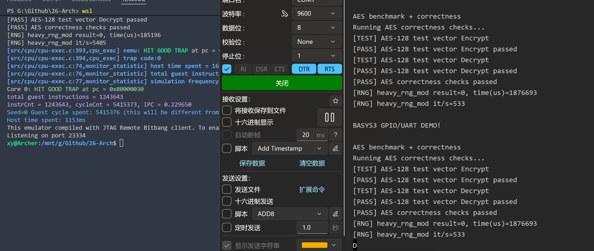

# Lab3 实验报告（Markdown）

## 1. 实验目标

根据课程 wiki（`wiki/Lab-3.md`），本次 Lab3 需要 CPU 支持并通过以下能力验证：

- 控制流：`beq bne blt bge bltu bgeu jal jalr auipc`
- 比较/移位：`slti sltiu slli srli srai sll slt sltu srl sra slliw srliw sraiw sllw srlw sraw`
- 完成仿真与 Basys3 上板联调，能够通过串口观察测试结果

---

## 2. 实验环境与工程信息

- 仓库：`G:/Github/26-Arch`
- CPU 主实现：`vsrc/src/core.sv`
- Vivado 工程：`vivado/test-cpu/project/project_3/project_3.xpr`
- 板卡：Basys3 (`xc7a35t`)
- 串口工具：串口调试助手（9600/8N1）

---

## 3. 初始失败现象

最初在 Lab3 测试中看到 difftest 早期偏差：

```text
priviledgeMode: 3
this_pc different at pc = 0x008000001c,
right= 0x000000008000001c,
wrong = 0x0000000080000028
Core 0: ABORT at pc = 0x0
```

该现象说明执行流在前几十条指令内发生分叉，存在以下可能：

1. 分支/跳转实现错误（功能 bug）
2. Vivado 工程加载了错误测试镜像（工程配置 bug）
3. 串口链路不稳定导致观测结果混乱（测试链路问题）

---

## 4. 试错排查全过程（按时间线）

### 4.1 串口链路先打通

- 初始遇到“端口未打开”，在 COM 列表中排查后，优先使用 `USB Serial Port` 对应端口（现场主要在 COM7/COM20 间确认）。
- 连接稳定后，串口先出现：

```text
BASYS3 GPIO/UART DEMO!
Button press detected!
```

这说明板上确实有程序在跑，但不是 Lab3 目标测试程序。

### 4.2 Hardware Manager 告警解释

烧录时反复出现：

```text
Device ... has no supported debug core(s)
The debug hub core was not detected
```

结论：该告警仅说明 bit 流没有 ILA/debug hub，不等于“程序没运行”；本次可用串口作为主观测通道，不以 debug hub 作为阻塞条件。

### 4.3 锁定核心问题：BRAM 的 COE 实际没生效

在 `project_3` 内设置 `bram_0` 初始化文件时，出现：

```text
Validation failed for parameter 'Coe_File' ... No COE file loaded
An attempt to modify disabled parameter 'Coe_File' ... has been ignored
```

继续执行 `report_ip_status` 发现 `bram_0` 为 stale/locked（IP revision 变化），导致 COE 参数修改被回滚。

### 4.4 升级 IP 后重新绑定 COE

执行（关键命令）：

```tcl
upgrade_ip [get_ips bram_0]
set ip [get_ips bram_0]
set coe G:/Github/26-Arch/vivado/test-cpu/project/ready-to-run/lab3/lab3-test.coe
set_property -dict [list CONFIG.Load_Init_File {true} CONFIG.Coe_File $coe] $ip
generate_target all $ip
```

执行后不再出现 “No COE file loaded” 的阻塞错误，说明镜像注入链路恢复。

### 4.5 “PC 不动”问题的澄清

中间一度看到波形上 PC 像是空白/不变。最终确认是“观察路径错误 + 波形对象选错”而非功能错误。

通过真实层级定位并重加波形：

```tcl
get_scopes -r /*
set c /simtop/soc_top/mycpu_top_inst/VTop_inst/core
add_wave -radix hex $c/fetch_pc
add_wave -radix hex $c/fetch_req_pc
add_wave $c/fetch_pending
add_wave $c/ireq.valid
add_wave $c/iresp.data_ok
```

分段运行并打印后确认：

```text
pc=0000000080000000
pc=0000000080000004
pc=0000000080000008
...
pc=000000008000001c
pc=0000000080000020
```

因此：PC 实际在正常递增，之前是观测误判。

### 4.6 最终上板通过特征

修复后串口输出进入 Lab3 正常测试流并出现 PASS：

```text
AES benchmark + correctness
[PASS] AES-128 test vector Encrypt passed
[PASS] AES-128 test vector Decrypt passed
[PASS] AES correctness checks passed
[RNG] heavy_rng_mod ...
```

这和 wiki 中的 Lab3 通过特征一致。

---

## 5. 代码实现细节（core.sv 关键逻辑）

以下为本次 Lab3 直接相关实现，均在 `vsrc/src/core.sv`。

### 5.1 译码层：控制流指令

- `AUIPC`：`op1 = id_r.pc`, `op2 = id_imm_u`，写回 `rd`（约 294-298 行）
- `JAL`：`id_dec_is_jal=1`, `id_dec_wb_pc4=1`, `imm=id_imm_j`（约 300-304 行）
- `JALR`：`id_dec_is_jalr=1`, `id_dec_wb_pc4=1`, `imm=id_imm_i`（约 305-311 行）
- `BRANCH`：`id_dec_is_branch=1`, `id_dec_br_funct3=id_funct3`, `imm=id_imm_b`（约 313-317 行）

说明：`JAL/JALR` 的返回地址由 `wb_pc4` 控制在后级写回 `pc+4`。

### 5.2 译码层：比较/移位指令族

- I 型比较/移位（`0010011`）：
  - `SLTI/SLTIU` -> `ALU_SLT/ALU_SLTU`（约 346-347 行）
  - `SLLI/SRLI/SRAI` -> `ALU_SLL/ALU_SRL/ALU_SRA`（约 345, 350-354 行）
- R 型比较/移位（`0110011`）：
  - `SLL/SLT/SLTU/SRL/SRA` 映射 ALU 命令（约 377-384 行）
- W 型（`0011011`, `0111011`）：
  - `SLLIW/SRLIW/SRAIW`（约 396-410 行）
  - `SLLW/SRLW/SRAW`（约 421-422 行）

### 5.3 EX 层 ALU 语义

- 比较语义：
  - `ALU_SLT` 使用 `$signed(op1) < $signed(op2)`（443 行）
  - `ALU_SLTU` 使用无符号比较（444 行）
- 移位语义：
  - 64 位移位使用 `op2[5:0]`（440-442 行）
  - 32 位（W 类）移位使用 `op2[4:0]`，并在结果阶段做 32->64 符号扩展（453-458 行）

该实现覆盖了 wiki 要求的 RV64I 控制流和移位比较指令行为。

### 5.4 分支决策与重定向

- 分支条件判定（BEQ/BNE/BLT/BGE/BLTU/BGEU）：462-471 行
- `JAL/JALR` 强制视为 taken：474 行
- next PC：
  - `JALR`: `((op1 + imm) & ~1)`（477 行）
  - 其他分支/跳转：`pc + imm`（477 行）
- 前端冲刷控制：
  - `ex_flush_front = ex_r.valid && ex_branch_taken`（478 行）
  - `ex_redirect_pc = ex_next_pc`（479 行）

### 5.5 IF 取指握手与 PC 更新状态机

关键寄存器：`fetch_pc`, `fetch_pending`, `fetch_req_pc`, `fetch_redirect_pending`。

- 发请求：`ireq.valid = ... && !stall_if_mem`（227 行）
- 发起新请求时保存 `fetch_req_pc <= fetch_pc`（822-825 行）
- 收到响应后：
  - 普通顺序流：`fetch_pc <= fetch_req_pc + 4`（818-821 行）
  - 重定向挂起：`fetch_pc <= fetch_redirect_pc`（812-817 行）
- 分支命中时：
  - 若有未返回请求，先置 `fetch_redirect_pending`（802-805 行）
  - 若无未返回请求，立即把 `fetch_pc` 切到 `ex_redirect_pc`（806-810 行）

这个状态机是本次“PC 看起来不动”误判的核心背景：只有按真实 scope 观察 `fetch_pc/fetch_req_pc/fetch_pending` 三者，才能正确理解时序。

### 5.6 流水线冲刷与写回路径

- 分支命中时冲刷前端和 ID（873-877 行）
- 跳转返回地址写回由 `mem_r.result <= ex_r.wb_pc4 ? (ex_r.pc + 4) : ex_result` 统一处理（864 行）
- trap 提交锁存与停机（787-797 行）

### 5.7 Lab3 的 difftest skip 逻辑

- `difftest_skip = wb_r.valid && (wb_r.is_load || wb_r.is_store) && !wb_r.mem_addr[31];`（509 行）

这与 wiki 建议“外设地址段访存跳过比对”一致，避免 MMIO 区间导致误报。

---

## 6. 根因总结

本次故障并非单点代码 bug，而是三类问题叠加：

1. **工程配置问题（主因）**：`bram_0` stale/locked 使 COE 未生效，板上跑了非 Lab3 镜像。  
2. **观测路径问题**：串口短时断开、端口选择混淆，导致先看到 DEMO 输出。  
3. **仿真观察问题**：波形路径不准，导致“PC 不动”的错误结论。

最终通过升级 IP + 重新绑定 COE + 重新实现烧录后闭环。

---

## 7. 复现实验步骤（可直接执行）

### 7.1 Vivado 端（关键 Tcl）

```tcl
open_project G:/Github/26-Arch/vivado/test-cpu/project/project_3/project_3.xpr
report_ip_status
upgrade_ip [get_ips bram_0]
set ip [get_ips bram_0]
set coe G:/Github/26-Arch/vivado/test-cpu/project/ready-to-run/lab3/lab3-test.coe
set_property -dict [list CONFIG.Load_Init_File {true} CONFIG.Coe_File $coe] $ip
generate_target all $ip
launch_runs impl_1 -to_step write_bitstream -jobs 8
wait_on_run impl_1
open_hw
connect_hw_server
open_hw_target
set_property PROGRAM.FILE {G:/Github/26-Arch/vivado/test-cpu/project/project_3/project_3.runs/impl_1/basys3_top.bit} [get_hw_devices xc7a35t_0]
program_hw_devices [get_hw_devices xc7a35t_0]
```

### 7.2 仿真观测端（关键 Tcl）

```tcl
restart
set c /simtop/soc_top/mycpu_top_inst/VTop_inst/core
add_wave -radix hex $c/fetch_pc
add_wave -radix hex $c/fetch_req_pc
add_wave $c/fetch_pending
add_wave $c/ireq.valid
add_wave $c/iresp.data_ok
run 500 ns
```

### 7.3 串口端

- 端口：板卡对应 `USB Serial Port`
- 参数：`9600, 8, None, 1`
- 判断通过：看到 AES correctness PASS 与 RNG 输出

---

## 8. 关键截图



---

## 9. 结论

- Lab3 已通过。  
- 代码侧控制流与移位比较实现完整，PC/flush/redirect 行为在仿真中可验证。  
- 本次失败主因不是核心逻辑缺失，而是 `project_3` 中 BRAM 初始化链路（COE + stale IP）问题。  
- 修复后上板串口输出与 wiki 通过特征一致。
