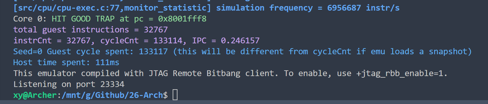

# Lab4 实验报告

## 1. CSR 指令实现

本次 Lab4 在已有五级流水 CPU 上加入 CSR 指令支持。CSR 指令统一在 `vsrc/src/core/core_decode.sv` 的 `7'b1110011` 分支中译码，根据 `funct3` 区分六条指令：

| 指令 | `funct3` | 写 CSR 的新值 | 写回通用寄存器 |
| --- | --- | --- | --- |
| `CSRRW` | `001` | `rs1` | CSR 旧值 |
| `CSRRS` | `010` | `csr_old \| rs1` | CSR 旧值 |
| `CSRRC` | `011` | `csr_old & ~rs1` | CSR 旧值 |
| `CSRRWI` | `101` | `zimm` | CSR 旧值 |
| `CSRRSI` | `110` | `csr_old \| zimm` | CSR 旧值 |
| `CSRRCI` | `111` | `csr_old & ~zimm` | CSR 旧值 |

其中 `zimm` 使用指令中的 `rs1` 字段零扩展得到：

```systemverilog
id_dec_csr_wdata = {59'd0, id_rs1};
```

CSR 指令写回 `rd` 的值是 CSR 修改前的旧值，因此译码阶段将 `id_dec_op1` 设置为 `id_csr_rdata`，后续按普通 ALU 加法路径把 `id_csr_rdata + 0` 写回：

```systemverilog
id_dec_wen = (id_rd != 0);
id_dec_op1 = id_csr_rdata;
id_dec_op2 = 64'd0;
```

对于 `CSRRS/CSRRC/CSRRSI/CSRRCI`，当源操作数为 0 时不应写 CSR，因此实现中用 `id_rs1 != 0` 控制 `id_dec_csr_wen`。这点比较重要，因为这些指令在源操作数为 0 时只读 CSR，不应该触发 CSR 副作用。

CSR 指令进入流水线时会携带三类信息：

- `csr_wen`：本条指令是否真的写 CSR。
- `csr_addr`：要访问的 CSR 编号，来自指令 `[31:20]`。
- `csr_wdata`：经过指令语义和 mask 处理后的最终 CSR 写入值。

这些字段定义在 `core_pkg.sv` 的 `ex_reg_t` 和 `wb_like_reg_t` 中，并随 `ID -> EX -> MEM -> WB` 逐级传递。这样 CSR 写入和普通寄存器写回一样，都在提交点统一生效，避免前级错误指令提前修改体系结构状态。

## 2. CSR 数据通路

CSR 指令的执行可以分成“读旧值、算新值、提交写入”三个步骤。

第一步在 ID 阶段读取旧值。译码模块根据 `id_csr_addr = id_r.instr[31:20]` 选择对应 CSR，例如：

```systemverilog
CSR_MSTATUS:  id_csr_rdata = csr_mstatus;
CSR_MTVEC:    id_csr_rdata = csr_mtvec;
CSR_MIP:      id_csr_rdata = csr_mip;
CSR_MIE:      id_csr_rdata = csr_mie;
CSR_MSCRATCH: id_csr_rdata = csr_mscratch;
CSR_MCAUSE:   id_csr_rdata = csr_mcause;
CSR_MTVAL:    id_csr_rdata = csr_mtval;
CSR_MEPC:     id_csr_rdata = csr_mepc;
CSR_MCYCLE:   id_csr_rdata = csr_mcycle;
CSR_MHARTID:  id_csr_rdata = csr_mhartid;
CSR_SATP:     id_csr_rdata = csr_satp;
```

第二步在 ID 阶段直接计算 CSR 新值。比如 `CSRRS` 是读出旧值后与 `rs1` 做或运算：

```systemverilog
id_dec_csr_wen = (id_rs1 != 0);
id_dec_csr_wdata = id_csr_rdata | id_rs1_val;
```

`CSRRC` 则是清除 `rs1` 指定的位：

```systemverilog
id_dec_csr_wen = (id_rs1 != 0);
id_dec_csr_wdata = id_csr_rdata & ~id_rs1_val;
```

第三步是在 WB 阶段提交写入。CSR 新值不会在 ID 阶段立即改变寄存器，而是随着流水线寄存器进入 `wb_r`，最后由 `core_csr.sv` 在时钟上升沿更新。这样 CSR 修改和普通寄存器写回使用同一个提交边界，difftest 看到的状态也和提交指令一一对应。

## 3. CSR 寄存器读写

CSR 状态集中放在 `vsrc/src/core/core_csr.sv` 中维护。普通 CSR 在 reset 时清零，在 WB 提交阶段根据 `wb_r.csr_addr` 更新：

```systemverilog
if (wb_r.valid && wb_r.csr_wen) begin
    unique case (wb_r.csr_addr)
        CSR_MSTATUS:  csr_mstatus  <= wb_r.csr_wdata;
        CSR_MTVEC:    csr_mtvec    <= wb_r.csr_wdata;
        CSR_MIP:      csr_mip_raw  <= wb_r.csr_wdata;
        CSR_MIE:      csr_mie      <= wb_r.csr_wdata;
        CSR_MSCRATCH: csr_mscratch <= wb_r.csr_wdata;
        CSR_MCAUSE:   csr_mcause   <= wb_r.csr_wdata;
        CSR_MTVAL:    csr_mtval    <= wb_r.csr_wdata;
        CSR_MEPC:     csr_mepc     <= wb_r.csr_wdata;
        CSR_SATP:     csr_satp     <= wb_r.csr_wdata;
        default: begin end
    endcase
end
```

`mhartid` 不需要寄存器保存，本实验只有一个核心，因此固定为 0：

```systemverilog
assign csr_mhartid = 64'd0;
```

`mcycle` 使用 `core_commit.sv` 中已有的 `cycle_cnt` 实现。正常情况下每周期自增；当提交阶段写入 `CSR_MCYCLE` 时，用写入值覆盖：

```systemverilog
if (wb_r.valid && wb_r.csr_wen && (wb_r.csr_addr == CSR_MCYCLE)) cycle_cnt <= wb_r.csr_wdata;
else cycle_cnt <= cycle_cnt + 64'd1;
```

译码阶段读取 CSR 时，根据 `id_csr_addr` 从当前 CSR 状态中选择读值。为了处理连续 CSR 指令之间的数据相关，如果前面流水级里已有同一 CSR 的待写值，则优先使用流水线中的新值：

```systemverilog
if (ex_r.valid && ex_r.csr_wen && (ex_r.csr_addr == id_csr_addr)) id_csr_rdata = ex_r.csr_wdata;
else if (mem_r.valid && mem_r.csr_wen && (mem_r.csr_addr == id_csr_addr)) id_csr_rdata = mem_r.csr_wdata;
else if (wb_r.valid && wb_r.csr_wen && (wb_r.csr_addr == id_csr_addr)) id_csr_rdata = wb_r.csr_wdata;
```

这样相邻 CSR 指令能够读到前一条 CSR 指令计算出的最新结果。

例如下面这种连续访问同一 CSR 的情况：

```assembly
csrw  mtvec, t0
csrr  t1, mtvec
```

第二条指令在 ID 阶段读 `mtvec` 时，第一条指令可能还没有真正到 WB 阶段更新 `core_csr.sv` 内部寄存器。如果只读寄存器保存的旧值，就会发生 CSR RAW 相关错误。因此这里让 ID 阶段优先检查 EX/MEM/WB 中待写的 `csr_wdata`，保证连续 CSR 指令读到最新体系结构结果。

## 4. CSR Mask 处理

部分 CSR 并不是所有位都可写，因此在 `vsrc/src/core/core_pkg.sv` 中加入 mask 常量：

```systemverilog
localparam logic [63:0] MSTATUS_MASK = 64'h0000_0000_007e_79bb;
localparam logic [63:0] SSTATUS_MASK = 64'h8000_0003_0001_e000;
localparam logic [63:0] MIP_MASK     = 64'h0000_0000_0000_0333;
localparam logic [63:0] MTVEC_MASK   = ~64'h0000_0000_0000_0002;
```

所有 CSR 写数据在进入流水线前调用 `sanitize_csr_write` 规整：

```systemverilog
function automatic logic [63:0] sanitize_csr_write(input logic [11:0] addr, input logic [63:0] data);
    begin
        sanitize_csr_write = data;
        unique case (addr)
            CSR_MSTATUS: sanitize_csr_write = data & MSTATUS_MASK;
            CSR_MTVEC:   sanitize_csr_write = data & MTVEC_MASK;
            CSR_MIP:     sanitize_csr_write = data & MIP_MASK;
            default: begin end
        endcase
    end
endfunction
```

`mepc` 没有使用额外 mask。测试中发现参考模型会保留写入的低位，因此最终没有对 `mepc[0]` 做强制清零。

这里把 mask 放在 `sanitize_csr_write` 中集中处理，而不是分散写在每条 CSR 指令中。这样 `CSRRW/CSRRS/CSRRC/CSRRWI/CSRRSI/CSRRCI` 六条指令虽然写入来源不同，但最终都会经过同一套 WARL 规整逻辑，避免不同指令对同一 CSR 的可写位处理不一致。

以 `mstatus` 为例，测试程序一开始会写入 `0xa00044`，但参考模型中只有 mask 允许的位能被保留，最终状态是 `0x200000`。因此如果不做 `MSTATUS_MASK`，difftest 会在第一条 CSR 写入处报错。

## 5. `mip` 中断 pending 位

`mip` 中有部分位来自外部中断输入。实现中将软件写入保存到 `csr_mip_raw`，再用 `trint/swint/exint` 覆盖对应 pending 位：

```systemverilog
assign csr_mip = (csr_mip_raw & ~64'h0000_0000_0000_0888) |
                 ({63'd0, exint} << 11) |
                 ({63'd0, trint} << 7) |
                 ({63'd0, swint} << 3);
```

这样既支持 CSR 指令读写 `mip`，也能反映外部中断输入状态。

这里没有直接把 `csr_mip` 作为寄存器保存，是因为 `mip` 的部分位本质上来自外部输入。如果直接保存最终值，外部中断输入变化时 CSR 读值不能及时反映 pending 状态。使用 `csr_mip_raw` 保存软件可写部分，再组合外部输入，可以同时满足 CSR 写入和外部中断显示两个需求。

## 6. Difftest 连接

Lab4 要求将 CSR 状态接入 difftest。最终在 `vsrc/src/core.sv` 中把 `DifftestInstrCommit`、`DifftestArchIntRegState`、`DifftestTrapEvent`、`DifftestCSRState` 的 `coreid` 都接为 `csr_mhartid[7:0]`。

`DifftestCSRState` 中的 CSR 连接如下：

```systemverilog
DifftestCSRState DifftestCSRState(
    .clock              (clk),
    .coreid             (csr_mhartid[7:0]),
    .priviledgeMode     (3),
    .mstatus            (csr_mstatus_diff),
    .sstatus            (csr_mstatus_diff & SSTATUS_MASK),
    .mepc               (csr_mepc_diff),
    .mtval              (csr_mtval_diff),
    .mtvec              (csr_mtvec_diff),
    .mcause             (csr_mcause_diff),
    .satp               (csr_satp_diff),
    .mip                (csr_mip_diff),
    .mie                (csr_mie_diff),
    .mscratch           (csr_mscratch_diff)
);
```

其中 `sstatus` 不单独保存，而是由 `mstatus` 按 `SSTATUS_MASK` 取子集得到。

为了让 difftest 在 CSR 提交当拍看到更新后的值，`core_csr.sv` 中额外生成了 `*_diff` 信号。如果本周期 WB 阶段正在写某个 CSR，则 `*_diff` 直接使用 `wb_r.csr_wdata`，否则使用寄存器中的当前值。

这个 preview 逻辑是必要的。CSR 寄存器本身在 `always_ff @(posedge clk)` 中更新，而 difftest 也在提交周期观察状态。如果直接把寄存器当前值接给 difftest，提交 CSR 指令的当拍可能仍然看到旧值，导致参考模型已经更新、DUT 仍显示旧 CSR 状态。`*_diff` 信号相当于给 difftest 提供“本拍提交之后”的体系结构状态。

## 7. 顶层流水线接入

CSR 实现最终接入到完整顶层流水线中。`vsrc/src/core.sv` 重新接回以下模块：

- `core_decode`
- `core_execute`
- `core_mdu`
- `core_csr`
- `core_commit`

顶层中 `core_decode` 负责产生 `id_dec_csr_wen/id_dec_csr_addr/id_dec_csr_wdata`，这些信号进入 `ex_r`：

```systemverilog
ex_r.csr_wen   <= id_dec_csr_wen;
ex_r.csr_addr  <= id_dec_csr_addr;
ex_r.csr_wdata <= id_dec_csr_wdata;
```

随后 EX/MEM 阶段继续传递：

```systemverilog
mem_r.csr_wen   <= ex_r.csr_wen;
mem_r.csr_addr  <= ex_r.csr_addr;
mem_r.csr_wdata <= ex_r.csr_wdata;
```

最后 MEM/WB 阶段传给 `wb_r`：

```systemverilog
wb_r.csr_wen   <= mem_r.csr_wen;
wb_r.csr_addr  <= mem_r.csr_addr;
wb_r.csr_wdata <= mem_r.csr_wdata;
```

`core_commit` 再把 `wb_r` 交给 `core_csr`，在提交点更新 CSR 状态。这样 CSR 指令不会破坏原有流水线结构，只是在已有流水线寄存器中增加了 CSR 相关控制和数据字段。

## 8. 调试中修正的关键点

实现过程中主要修正了两个和 CSR 一致性相关的问题。

第一，`mstatus` 必须按 mask 保存。未加 mask 时，测试中 `csrw mstatus, x1` 会把 `0xa00044` 原样写入，而参考模型只保留合法位 `0x200000`。加入 `MSTATUS_MASK` 后，写入行为与参考模型一致。

第二，`mepc` 不应强制清零低位。最初按照对齐理解把 `mepc[0]` 清零，但 Lab4 当前测试和参考模型保留该位，导致 `mepc` 在 `0x80000180` 附近出现 `right=7, wrong=6` 的差异。删除 `mepc` 的额外规整后，测试通过。

## 9. 验证结果

在 WSL 中运行：

```bash
make test-lab4
```

最终输出：

```text
Core 0: HIT GOOD TRAP at pc = 0x8001fff8
total guest instructions = 32767
instrCnt = 32767, cycleCnt = 133114, IPC = 0.246157
```

说明 CSR 指令、CSR 寄存器状态、CSR mask 处理以及 difftest 连接均通过 Lab4 测试。


