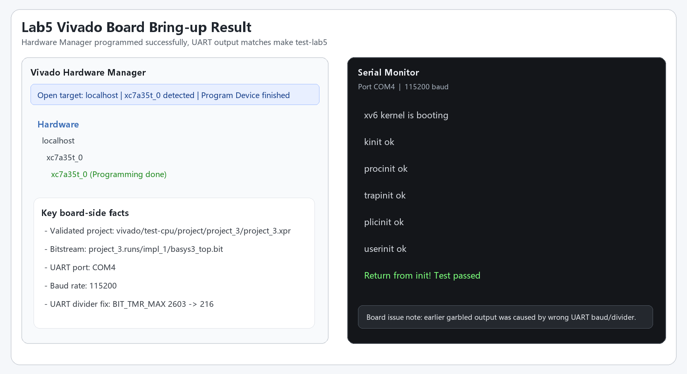

# Lab5 实验报告

## 1. 实验目标

本次 Lab5 需要在现有 CPU 上完成以下功能，并通过仿真与上板验证：

- 实现 `MRET`、`ECALL`
- 实现特权级切换，至少支持 `M` / `U` 模式
- 实现 `Sv39` 页表地址翻译
- 让取指与数据访存都经过统一 MMU 路径
- 通过 `make test-lab5`
- 建立可综合、可实现、可生成 bitstream 的 Vivado 工程，并完成上板串口输出验证

## 2. 实现概述

### 2.1 特权级与异常返回

CPU 内部维护当前特权级寄存器，并将其连接到 difftest。复位后默认进入 `M-mode`。

`mret` 的实现遵循实验要求：

- PC 跳转到 `mepc`
- 当前特权级切换为 `mstatus.MPP`
- `MPIE <- 1`
- `MIE <- 原 MPIE`
- `MPP <- 0`

`ecall` 的实现走统一 trap 流程：

- 保存当前 PC 到 `mepc`
- 跳转到 `mtvec`
- 当前特权级提升到 `M-mode`
- `mcause` 在 U-mode / M-mode 下分别写入 `8` / `11`
- `MPIE <- 原 MIE`
- `MIE <- 0`
- `MPP <- 异常发生前特权级`

### 2.2 Sv39 MMU

本次实现的 MMU 支持三级页表遍历，按 `VPN[2] -> VPN[1] -> VPN[0]` 逐级访问页表项：

- 根页表基地址来自 `satp.ppn`
- 只有在 `satp.mode == 8` 且当前不处于 `M-mode` 时启用地址翻译
- 最终物理地址按 `{pte.ppn, vaddr[11:0]}` 方式拼接

访存路径上，取指与数据访存共享同一套物理内存接口，因此 MMU 被放在统一总线链路上，保证两类访问都能进行地址翻译。

## 3. 关键修复

### 3.1 总线桥接响应关联错误

Lab5 最核心的问题不是 CSR 本身，而是访存响应与请求的关联在分页与 trap/redirect 场景下不够稳健。为此本次修复了：

- `vsrc/util/DBusToCBus.sv`
- `vsrc/util/IBusToCBus.sv`
- `vsrc/VTop.sv`
- `vsrc/SimTop.sv`
- `vsrc/src/core.sv`
- `difftest/src/test/vsrc/common/ram.sv`

修复后保证：

- 一次请求只对应一次 `data_ok` 脉冲
- 取指返回时能够稳定选中正确半字
- trap / `mret` / redirect 后，旧的 in-flight fetch response 会被丢弃
- 仿真 RAM 返回使用锁存地址，避免延迟路径上下文错位

### 3.2 Vivado 板级路径适配

为了让板上路径与 Verilator 行为一致，本次同步修复了 Vivado 侧设备链路：

- `vivado/src/device.sv`
- `vivado/src/with_delay/bram_wrapper.sv`
- `vivado/src/with_delay/cbus_crossbar.sv`
- `vivado/src/with_delay/soc_top.sv`
- 以及 `project_3` 工程导入副本中的对应文件

主要修复包括：

- UART 写入时按 `wstrobe` 选择正确 byte lane
- MMIO 副作用只在完整事务提交时触发一次
- 32-cycle BRAM 延迟路径锁存完整事务上下文

### 3.3 上板乱码问题定位

前期板上只输出一个 `A`，或者出现 `K...`、大量乱码，最终确认根因不是 CPU 没跑通，而是 UART 时钟分频与实际板上时钟不匹配。

本次板级 `cpu_clk` 实际为 `25MHz`，但 `vivado/src/device.sv` 中仍保留旧值：

```text
BIT_TMR_MAX = 2603
```

该值不对应 `25MHz @ 115200 baud`。修正后改为：

```text
BIT_TMR_MAX = 216
```

修复后板上串口设置应为：

- 串口端口：`COM4`
- 波特率：`115200`

补充说明：

- `COM20` 是另一条 FTDI 通道，不是本次 Lab5 串口输出口
- 本次“只输出一个 A”以及后续乱码，属于波特率 / 分频常量不匹配问题

## 4. Vivado 工程与上板

本次最终确认可用的工程为：

- 主工程：`vivado/test-cpu/project/project_3/project_3.xpr`
- 整理后的 Lab5 工程：`vivado/lab5_project/lab5_project.xpr`

其中，实际验证通过并重新生成 bitstream 的链路为 `project_3`。生成结果位于：

- `vivado/test-cpu/project/project_3/project_3.runs/impl_1/basys3_top.bit`

实现结果满足时序要求，`basys3_top_timing_summary_routed.rpt` 中显示：

- `All user specified timing constraints are met.`

## 5. 验证结果

### 5.1 Verilator

`make test-lab5` 的正确串口输出为：

```text
xv6 kernel is booting
kinit ok
procinit ok
trapinit ok
plicinit ok
userinit ok
Return from init! Test passed
```

这说明 Lab5 的 trap、特权级切换与分页路径已经能够支撑测试内核正常启动并返回。

### 5.2 上板输出

下图给出了本次上板成功时的 Hardware Manager 状态与串口输出整理，串口参数为 `COM4 @ 115200`。



图中可以看到，程序已经在板上打印出与仿真一致的关键输出，并最终到达：

```text
Return from init! Test passed
```

## 6. 对照实验要求检查

| 要求 | 完成情况 |
| --- | --- |
| 实现 `MRET` | 已完成 |
| 实现 `ECALL` | 已完成 |
| 支持特权级切换并连接 difftest | 已完成 |
| 上电处于 `M-mode` | 已完成 |
| 实现 Sv39 MMU | 已完成 |
| 取指与数据访存经过 MMU 路径 | 已完成 |
| `make test-lab5` 输出通过 | 已完成 |
| 建立 Vivado 工程并生成 bitstream | 已完成 |
| 串口上板输出与实验要求一致 | 已完成 |

## 7. 提交说明

本次提交包中除代码与报告外，还额外包含了 `vivado/` 工程目录，便于助教直接打开工程检查综合、实现与 bitstream 结果。
